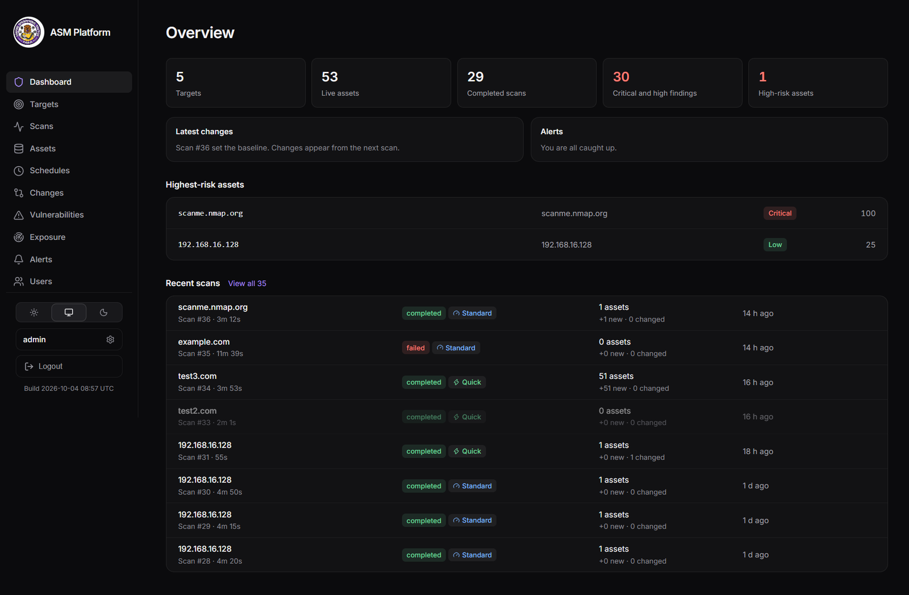
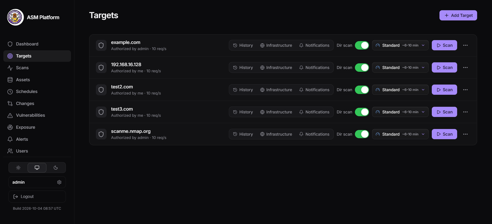
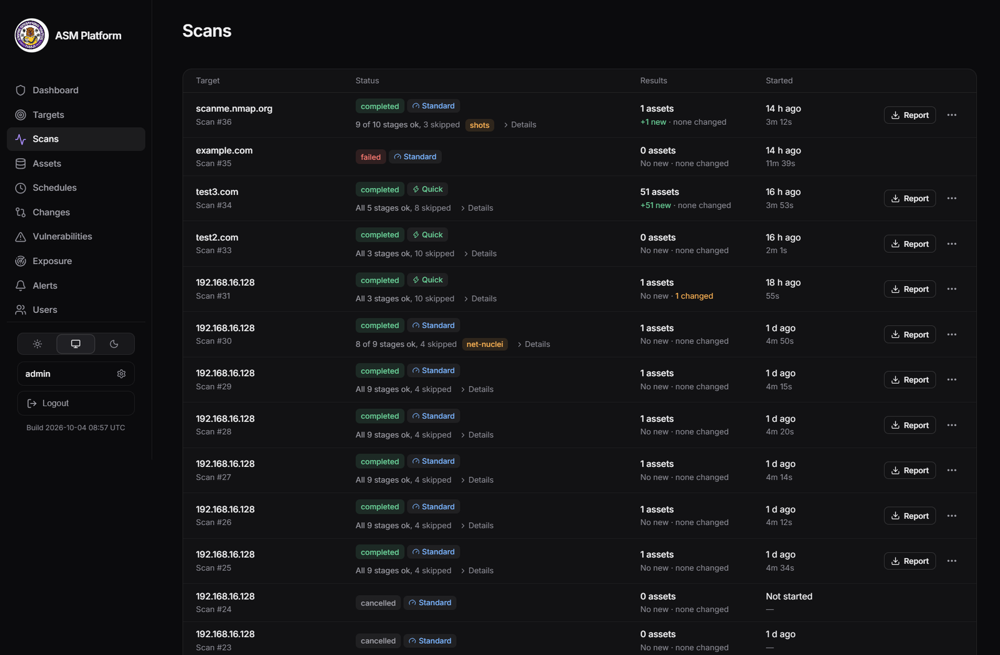
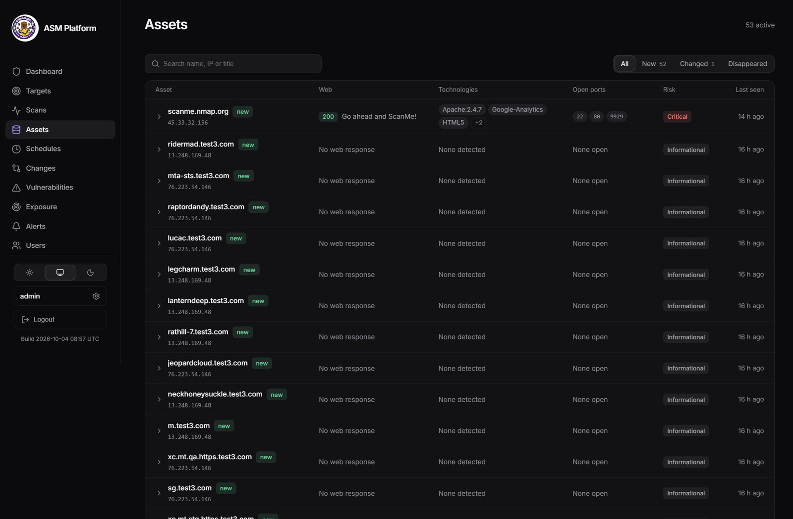
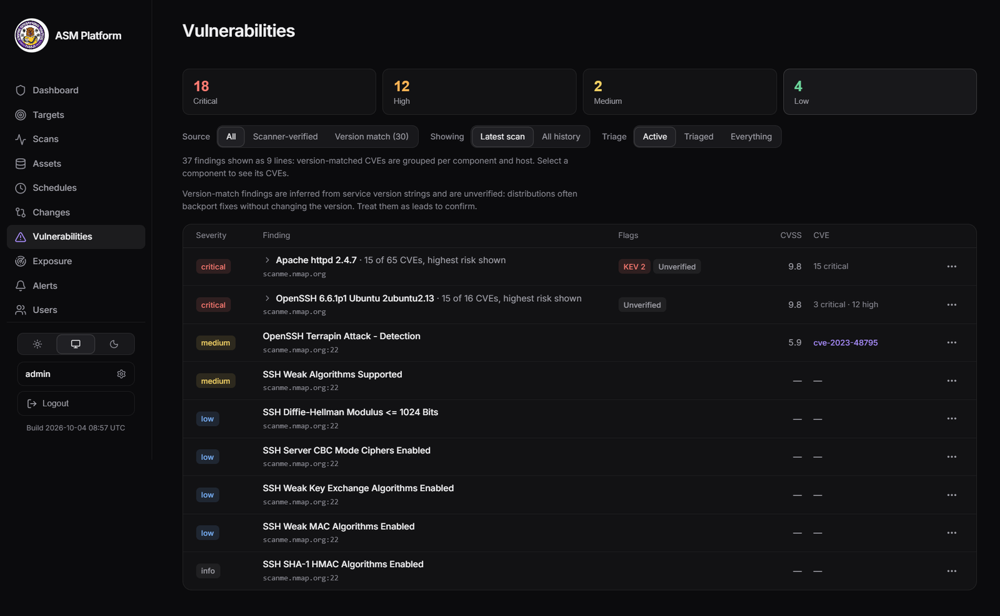
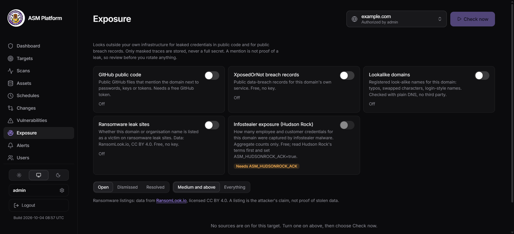
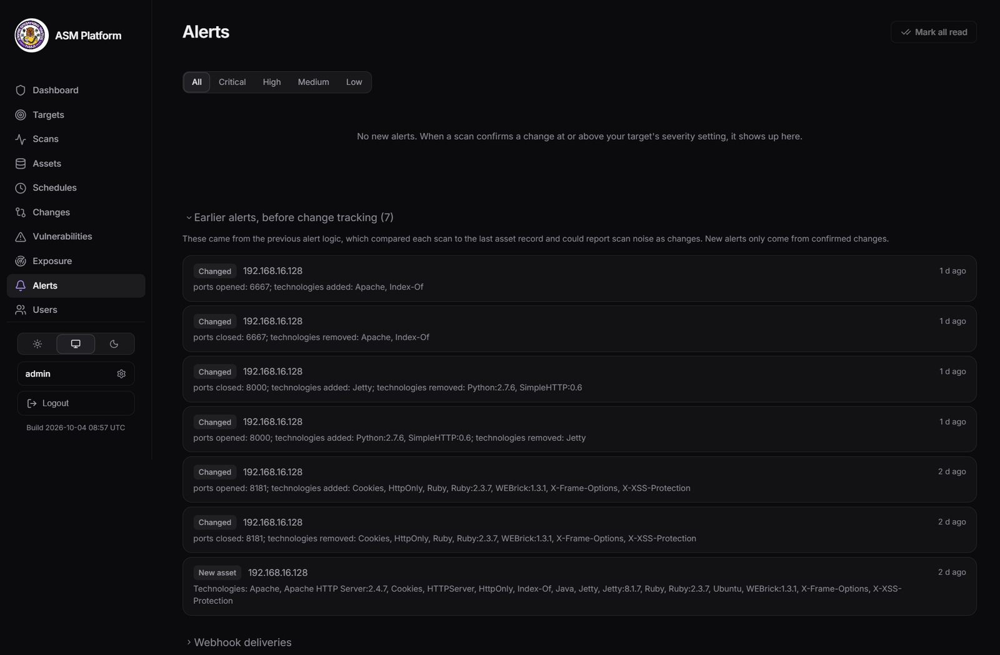
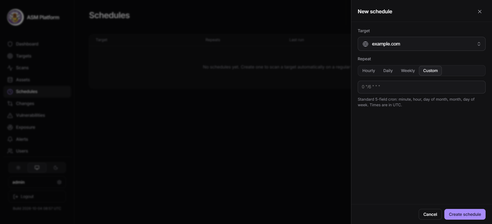
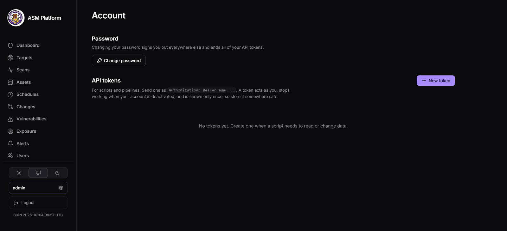

<div align="center">

# ASM Platform

### Self-hosted attack surface management

Discover what you expose to the internet, find what is vulnerable, and get told when it changes. One platform you run yourself.

[](https://github.com/TurlaFSB/ASM-/actions/workflows/ci.yml)
[](https://github.com/TurlaFSB/ASM-/actions/workflows/security.yml)


[](LICENSE)

[Quick start](#quick-start) · [Features](#features) · [Documentation](#table-of-contents) · [Changelog](CHANGELOG.md) · [Security policy](SECURITY.md)



</div>

---

## What is ASM Platform?

ASM Platform is an open-source **external attack surface management (EASM)** tool. You give it a domain or host you are authorized to test, and it maps everything reachable from the outside: subdomains, IP addresses, open ports, running services, web technologies, exposed paths, TLS configuration and known vulnerabilities. It then watches that surface over time and reports **what changed**: a port opened, a service appeared, a sensitive path became reachable, a new CVE applies.

It runs entirely on your own infrastructure with Docker Compose. There is no SaaS account, no per-asset pricing and no scan data leaving your machine, apart from the public lookups you choose to turn on.

**What makes it different**

- **Change-first.** Every scan is stored as a snapshot and compared with the previous comparable one. A coverage-aware trust model means a timed-out stage never produces a false "closed" or "removed" alert.
- **Risk you can act on.** Findings are scored against CISA's Known Exploited Vulnerabilities (KEV) catalog, so *Critical* means exploitation in the wild, not just a high CVSS number. Version-matched CVEs are labelled *inferred* and kept apart from scanner-confirmed findings.
- **Beyond your own infrastructure.** Optional exposure monitoring looks for leaked credentials in public code, breach records, lookalike domains, ransomware listings and infostealer counts.
- **Evidence that holds up.** Every scan is sealed into a signed, hash-chained history, and each scan produces a client-ready PDF report.
- **Built to be run safely.** Authorization is enforced at the API, private ranges are refused by default, and the platform itself follows the security practices it checks for (see [Security posture](#security-posture)).

### What you can use it for

| Use case | How ASM helps |
|---|---|
| **Continuous perimeter monitoring** | Scheduled scans, change alerts by in-app message, webhook (JSON, Slack, Discord) or email, and a Prometheus metrics endpoint. |
| **Penetration tests and red-team recon** | A repeatable, diffable recon baseline before manual testing, with full target profiles: ownership, live technology stack and exposed service inventory. |
| **Vulnerability management** | Triage findings (in progress, false positive, accepted risk, resolved) with reasons and expiry, and export to CSV, JSON or SARIF for pipelines, GitHub code scanning and DefectDojo. |
| **Consulting and client reporting** | Client-ready PDF reports with an executive summary, remediation tiers and the signed scan seal, without a SaaS subscription. |
| **Brand and leak monitoring** | Spot typosquat domains, public code that mentions your domain next to secrets, and ransomware or infostealer exposure. |
| **Learning and research** | A real multi-service system (queue, database, scanners, report engine, signed history) to study and extend. |

### Capabilities at a glance

| Discover | Assess | Monitor | Report and integrate |
|---|---|---|---|
| Subdomains, DNS, WHOIS and ASN | Nuclei templates and network checks | Snapshot diffs with severity | PDF reports with remediation SLAs |
| Port and service detection | CVE matching with KEV enrichment | Alerts, webhooks and email, with optional local-AI notes | CSV, JSON and SARIF exports |
| Web technology fingerprinting | TLS audit, takeover, email security, cloud storage and exposed files | Scheduled scans and a scan watchdog | API tokens and REST API |
| Directory discovery and screenshots | Exposure and leak checks | Tamper-evident history | Verified backups, restore drill, Prometheus metrics, JSON logs |

---

## Screenshots

**Targets.** Add authorized targets, choose a scan profile, and set notifications, tags and directory scanning per target.



**Scans.** Per-stage results for every run, with the report, exports and screenshots from each scan's menu.



**Assets.** A searchable inventory with technologies, open ports, risk and what is new or changed.



**Vulnerabilities.** Scanner-confirmed findings and version-matched CVEs grouped per component, with KEV flags and triage.



**Exposure.** Switch on the sources you want per target: GitHub code, breach records, lookalike domains, ransomware listings and infostealer counts.



**Alerts.** Confirmed changes at or above each target's severity, plus a delivery log for webhooks and email.



**Schedules and account.** Recurring scans by cron or preset, and API tokens for scripts and CI.





A sample of the client-ready report generated for every scan: [https://drive.google.com/file/d/1QaFbcC_UMToU7FzfaigT-inO6tECE3_0/view?usp=sharing].

---

## Table of Contents

- [What is ASM Platform?](#what-is-asm-platform)
- [Screenshots](#screenshots)
- [Architecture](#architecture)
- [Features](#features)
- [Scan profiles](#scan-profiles)
- [Change detection](#change-detection)
- [Notifications](#notifications)
- [Posture checks](#posture-checks)
- [Exposure monitoring](#exposure-monitoring-leaks-breaches-mentions)
- [Scan integrity](#scan-integrity-tamper-evident-history)
- [Security posture](#security-posture)
- [Quick start](#quick-start)
- [Configuration](#configuration)
- [Usage](#usage)
- [API](#api)
- [Scanning private and lab targets](#scanning-private-and-lab-targets)
- [Development and testing](#development-and-testing)
- [Upgrading](#upgrading)
- [Production deployment](#production-deployment)
- [Backup and restore](#backup-and-restore)
- [Troubleshooting](#troubleshooting)
- [Roadmap](#roadmap)
- [Known limitations](#known-limitations)
- [Contributing and security](#contributing-and-security)
- [Scope and responsible use](#scope-and-responsible-use)
- [Credits and further reading](#credits-and-further-reading)
- [License](#license)

---

## Architecture

```text
┌─────────────┐      ┌──────────────┐      ┌─────────────┐
│    React    │─────▶│   FastAPI    │─────▶│ PostgreSQL  │
│  Frontend   │◀─────│   Backend    │◀─────│             │
└─────────────┘      └──────┬───────┘      └─────────────┘
                            │
                            ▼
                     ┌──────────────┐      ┌─────────────┐
                     │ Celery Queue │─────▶│    Redis    │
                     │    + Beat    │      │             │
                     └──────┬───────┘      └─────────────┘
                            │
                            ▼
   ┌────────────────────────────────────────────────────────────┐
   │                      Scan pipeline                         │
   │                                                            │
   │  Subfinder, Amass → DNS → WHOIS/ASN → Nmap → httpx         │
   │     → WhatWeb · Directory discovery · Nuclei (parallel)    │
   │     → CVE match · sslyze · EyeWitness                      │
   │     → Takeover · Email security · Cloud storage · Files    │
   │     → Snapshot + diff → Risk scoring                       │
   └────────────────────────────────────────────────────────────┘
```

Each scan runs as one Celery task and reports progress per stage to the UI. Database schema is managed by **Alembic**; a one-shot `migrate` service applies migrations before the API and workers start.

| Service | Role |
|---|---|
| `postgres` | Primary datastore |
| `redis` | Celery broker and result backend |
| `migrate` | One-shot `alembic upgrade head` |
| `volume-init` | Production overlay only: fixes ownership of data volumes, then exits |
| `backend` | FastAPI application (cookie and bearer auth, REST API) |
| `celery_worker` | Executes scans |
| `celery_beat` | Triggers scheduled scans |
| `frontend` | React single-page app served by nginx with a strict Content Security Policy |

---

## Features

### Reconnaissance
- Subdomain enumeration (Subfinder, Amass); the apex target is always included, so private and lab hosts work
- WHOIS and ASN lookup: registrar, dates, name servers, network ownership
- DNS resolution, Nmap service/version detection, httpx probing with redirect following
- WhatWeb technology fingerprinting merged with httpx detection and de-duplicated
- Directory and content discovery with feroxbuster and a curated wordlist, rate-limited per target
- EyeWitness screenshots of every live web service, browsable per scan in a gallery on the Scans page

### Vulnerability and TLS analysis
- Nuclei template scanning for web services, plus network-level templates against discovered ports
- **CVE matching** of detected service versions against the NVD (CPE-based, vulnerable-component only). These findings are labelled *inferred* and grouped per component, separate from *confirmed* template matches
- sslyze TLS audit: deprecated protocols, weak ciphers, expired certificates, SHA-1 chains, Heartbleed
- KEV and exploitability enrichment on every matched CVE

### Posture checks
Light, mostly DNS-based checks for the misconfigurations that cause real incidents. They run inside the normal scan, their findings appear on the Vulnerabilities page and in reports, and they feed change detection like any other finding. See [Posture checks](#posture-checks).
- **Subdomain takeover**: dangling CNAMEs and unclaimed third-party services (GitHub Pages, Azure, Heroku, S3, Shopify and others)
- **Email security**: SPF, DMARC, DKIM key strength and MTA-STS
- **Cloud storage exposure**: public S3, Google Cloud Storage and Azure Blob listings named after the domain
- **Exposed sensitive files**: `.git`, `.env`, backups, credentials and debug pages, confirmed by their content

### Change tracking and notifications
- Versioned snapshots of assets, ports, services, technologies, HTTP metadata, discovered paths and findings
- Structured, severity-rated change events with a coverage-aware trust model (see [Change detection](#change-detection))
- In-app alerts, webhooks and email driven by confirmed change events: a per-target minimum severity, pending removals never notify, and one bounded digest per scan (CVE roll-ups folded into one line per component). See [Notifications](#notifications)

### Risk and reporting
- Per-asset risk scoring: CVSS baseline, boosted for high-risk ports and admin surfaces, force-escalated to Critical when a matched CVE is in KEV
- Client-ready **PDF reports**, pre-built in the background after each scan and cached, so downloads are instant: executive summary with top actions, asset inventory, infrastructure, confirmed findings, inferred findings grouped per service, change detection, and remediation with SLA tiers
- **Finding triage**: mark a finding, a component or a CVE as In progress, False positive, Accepted risk or Resolved. False positive and Accepted risk require a written reason; accepted risk expires (default 90 days, max 365) and the finding returns for review. Resolved findings stay hidden until a later scan reports them again. Triaged findings are left out of PDF reports and counts, and are never deleted
- Exports: CSV for assets and findings (with triage status and note), plus JSON and SARIF 2.1.0 findings for pipelines, GitHub code scanning and DefectDojo
- **Optional AI notes** from a local model (Ollama): a one-line summary and a recommended next step for each confirmed change. The rules decide severity unless you opt in to `adjust`; output that fails a strict schema or claims things the data does not say is discarded, and a scan never waits on the model (see [AI-assisted triage](#ai-assisted-triage-optional))

### Operations
- Light and dark themes (match system by default), keyboard-navigable menus, and no WCAG A/AA violations in automated checks
- Three scan profiles (Quick, Standard, Deep), with a per-target default for scheduled scans. Quick runs only the DNS-based posture checks (takeover, email security); Standard and Deep add cloud storage and exposed files
- Recurring scans via Celery Beat (cron expressions or presets)
- Cookie sessions (httpOnly, SameSite, CSRF-protected) for the web app, and bearer tokens or revocable, expiring **API tokens** for scripts and CI; no default credentials
- Admin and viewer roles: viewers are read-only
- Exposure monitoring for leaks, breaches, lookalike domains, ransomware listings and infostealer counts (see [Exposure monitoring](#exposure-monitoring-leaks-breaches-mentions))
- Tamper-evident scan history: signed, chained seals per scan, shown in the PDF report (see [Scan integrity](#scan-integrity-tamper-evident-history))
- Target, asset, vulnerability and scan lists with search, filters and a side panel for details; target pickers that scale to many targets; free-form **tags** to group targets and filter the list
- Prometheus metrics (`/metrics`), optional JSON logs and automatic retention of scan artifacts
- **Backups you can trust**: scheduled database dumps that are read back and checksummed before they are kept, and a restore drill (`restore.sh verify`) that restores the newest one into a scratch database and compares tables and schema revision. `restore.sh apply` replaces the live database in a single transaction, so a failed restore changes nothing (see [Backup and restore](#backup-and-restore))
- Audit log of target, scan and authentication actions, with source IP

### Resilience and abuse protection
- **Cancel any scan**, queued or running: the scanner processes it started (nmap, nuclei, feroxbuster and others) are stopped too, and deleting a target cancels its scans and pauses its schedules
- **One scan per target at a time**, enforced by a lock that survives a worker restart; a **watchdog** fails scans whose worker was lost or that run past `SCAN_MAX_SECONDS`, so a target is never blocked for good
- **Redis keeps its data** (append-only file in a named volume), so a restart does not drop queued scans or scan locks
- Every tool and stage is time-bounded and reports a precise status (`ok`, `empty`, `timeout`, `not installed`, `failed`); a stage that did not run cleanly can never make something look fixed
- **Login brute-force protection**: failures are counted per client and username, per client and per username, and lock further attempts for 15 minutes whatever password is tried; a global per-client API rate limit sits on top (see [Security posture](#security-posture))
- Production containers run non-root with a read-only filesystem and all capabilities dropped (the worker keeps only `NET_RAW` for nmap), and the worker has a memory cap
- Docker Compose deployment with healthchecked dependencies, plus a hardened non-root production overlay (see [Production deployment](#production-deployment))
- Clear action feedback in the UI: scan state on each target row, optimistic switches that roll back and explain when a save fails

---

## Scan profiles

| Profile | Ports | Directory discovery | Nuclei (web) | Typical duration |
|---|---|---|---|---|
| **Quick** | Top 100 | none | high, critical | ~2 min |
| **Standard** (default) | Top 1000 plus common web/admin ports | curated core list | medium and above | ~10-12 min |
| **Deep** | All 65535 | core list plus extensions and `common.txt` | medium and above, long budget | ~20-30 min |

Durations are measured on a small lab host and vary with target size. Standard adds about 30 common web, admin and database ports that are outside nmap's top 1000. Services on other ports are not seen by Quick or Standard; use Deep for full-range coverage. Service version detection gets deeper with each profile, which improves CVE matching.

---

## Change detection

Each completed scan is stored as a snapshot. A new scan is compared only with the previous snapshot **of the same profile**, and only for the sections both scans actually covered.

| Rule | Behaviour |
|---|---|
| **Coverage gating** | A section is compared only if the stage ran cleanly in both scans. A timed-out or skipped stage never produces false "closed" or "removed" events. |
| **Additions vs removals** | Additions need a full baseline. Removals need both scans to be full. A partial directory scan is additive-only. |
| **Removal debounce** | The first missing item is held as *pending*. If it is missing again on the next comparable scan it is *confirmed*; if it returns, it is dismissed silently. |
| **Version comparison** | Versions are compared only when both scans report one. |
| **Confidence** | Events are marked *confirmed* or *inferred* (for example version-matched CVEs). |

Event categories: `asset`, `port`, `technology`, `http`, `path`, `finding`. Severity is assigned per rule, for example a newly opened risky port or a newly reachable sensitive path is **high**.

Recompute the events of the newest scan of a profile (for example after upgrading the engine):

```bash
docker compose exec backend python -m backend.scripts.rediff <scan_id>
```

### AI-assisted triage (optional)

With a local model enabled, each confirmed change also gets a one-line summary and a recommended next step. By default (`ASM_LLM_SEVERITY_MODE=advise`) the rules decide severity and the model only explains (hover the AI badge on the Changes page to see when it rated a change differently). Setting `adjust` lets the model move severity by one step (never lowering a high or critical change, or one tied to a known-exploited CVE). Turn that on only for a model that passes the evaluation below. Both the rule severity and the AI's own answer are always kept. Nothing leaves your machine with the `ollama` provider.

- Model output must match a strict schema; anything else, text containing links or commands, or an answer two or more severity steps away from what the rules allow (the sign of a model that was talked into something) is discarded together with its text, and the rules stand.
- Scanned content reaches the model only as short, whitelisted, sanitized fields, and the prompt treats it as untrusted data.
- Summaries may not assert things the event data does not say (no authentication, default credentials, "exposed to the internet", active exploitation without a KEV flag); a summary that does is discarded.
- Per scan it is bounded (`ASM_LLM_MAX_EVENTS`, `ASM_LLM_BUDGET_SECONDS`) and stops early when the model is down, so a scan never waits on it.
- The Changes page marks AI notes as advisory. Alerts and webhooks use the final severity.

Measured on a 6 GB laptop GPU (48-case set): `qwen2.5-coder:7b` takes about 3 s per event and `qwen2.5-coder:14b` about 21 s (it spills into system RAM). The 14B model writes noticeably more specific next steps and invents fewer claims; the 7B model's actions are often generic. With the default per-scan budget of 180 s, a 14B model covers roughly the 8 most severe events of a scan, so raise `ASM_LLM_BUDGET_SECONDS` (for example to 600) if you use it. Neither model improved on the rule-based severity (the 14B simply agreed with the rules, the 7B drifted), which is why `advise` is the default.

Check the setup with `docker compose exec backend python -m backend.scripts.ai_smoke`. To measure a model before trusting it, run the labelled evaluation (48 cases covering exposed databases, secrets, KEV findings, noise, removals and prompt injection):

```bash
docker compose exec backend python -m backend.scripts.ai_eval
```

It writes a JSON report, prints whether `adjust` mode is worth enabling (the gates passed and the model moved more cases closer to the labelled answer than away from it), and exits non-zero unless every quality gate passes: at least 95% valid answers, no visible prompt-injection effect, no serious change lowered by the model, at least 85% of final severities within one step of the labelled answer, and severities no worse than the rules alone. The case inputs use the severities the diff engine really assigns, and a test keeps them in sync.

---

## Notifications

Every target has its own settings (Targets, then **Notifications**): a minimum severity, an optional webhook and an optional list of email recipients. Only *confirmed* change events notify, so a first (baseline) scan is silent and a removal that is only pending never fires. Everything is still recorded on the Changes page.

| Channel | What is sent |
|---|---|
| In-app alerts | One per qualifying event, capped per scan; an overflow row says how many were left out |
| Webhook | One digest per scan (and one per exposure run). Generic JSON, Slack or Discord format |
| Email | The same digest as one message per scan or exposure run, as plain text plus HTML, to up to 10 recipients per target |

**Webhooks** must be HTTPS and resolve to public addresses; the connection is pinned to the checked address, redirects are never followed, failures retry with backoff, and JSON messages are signed with HMAC-SHA256 (`X-ASM-Signature` over `<timestamp>.<body>`) so your receiver can verify them. The signing secret is shown once.

**Email** needs a mail server, which is a deployment setting rather than a per-target one. Add it to `.env.docker`:

```env
ASM_SMTP_HOST=smtp.example.com
ASM_SMTP_PORT=587
ASM_SMTP_SECURITY=starttls
ASM_SMTP_USER=asm@example.com
ASM_SMTP_PASSWORD=<password or app password>
ASM_SMTP_FROM=asm@example.com
ASM_PUBLIC_URL=https://asm.example.com
```

Recreate the services (`docker compose up -d backend celery_worker`), then add recipients under the target's Notifications panel and press **Send test email**. With Gmail, use an [app password](https://myaccount.google.com/apppasswords) (not your account password) and the same address for `ASM_SMTP_USER` and `ASM_SMTP_FROM`. Messages carry no secrets, scan-derived text is HTML-escaped, line breaks are stripped from headers, and TLS certificates are always verified.

Every delivery, whether webhook or email, is recorded and shown on the **Alerts** page with its result. A failed delivery never affects the scan or its in-app alerts.

---

## Posture checks

Four checks that need no heavy tooling, run as part of every Standard and Deep scan (Quick runs the two DNS-only ones). Each one only reports what it can prove, says so when it could not finish, and never stores secrets.

| Check | What it looks for | Severity | Runs on |
|---|---|---|---|
| **Subdomain takeover** | A name whose CNAME points at a missing resource at a known provider (high), a provider "not claimed" page (high), or any other dangling CNAME (medium; low if it points inside your own domain) | high / medium / low | Every discovered name, live or not |
| **Email security** | Missing, multiple, `+all`, `?all`, `ptr` or over-limit SPF; missing or monitor-only DMARC, `pct` below 100, `sp=none`, no `rua`; DKIM keys under 2048 bits (common selectors only); no MTA-STS | high to info | The target domain |
| **Cloud storage** | A bucket or container named like your domain (`acme`, `acme-backup`, `acme-dev`, ...) that lists its contents to anyone, on S3, Google Cloud Storage or Azure Blob | medium, or info for short and common-word names, shown as *inferred* | The target domain |
| **Exposed files** | `/.git/HEAD`, `/.env`, `/.svn/wc.db`, `/.htpasswd`, `/.aws/credentials`, SSH keys, `wp-config` backups, `backup.zip` / `.sql` dumps, `phpinfo()`, `server-status`, Spring `/actuator/env` | critical to low | Each live web host |

How they stay trustworthy:
- **Content, not status codes.** An exposed file is reported only when its first few KB prove it (a git `ref:` line, `KEY=value` lines, ZIP or gzip magic bytes, a SQL dump header). A site that answers 200 to everything produces no findings. Redirects are never followed.
- **Nothing sensitive is kept.** At most 4 KB is read and none of it is stored. Findings carry the path and a reason, never a value, an archive's file names or a bucket's object names.
- **Bucket findings are leads.** Anyone can create a bucket named `acme-backup`, so these findings are marked *inferred*, are never rated above medium (info for short or common-word domains such as `example.com`, where a stranger's bucket is the likely match) and ask you to confirm ownership first. Private buckets (403) are not findings. Only the existence of a public listing is checked; no object is downloaded.
- **Takeover findings are candidates.** Providers change how they behave, so verify before acting. Nothing is ever registered or claimed.
- **Silence is never "fixed".** A check that could not run properly (blocked egress, DNS errors) is recorded as partial and cannot produce "resolved" events. A resolved finding must be absent from two comparable scans before it is confirmed.
- **Public domains only.** IP and internal targets skip takeover, email and cloud checks. The exposed-file check still runs against their web ports.
- Fixed provider hostnames and validated candidate names mean the bucket check cannot be steered at an internal address.

Limits: DKIM selectors cannot be enumerated, so a domain whose selector is not in the built-in list shows none and that is not reported as a problem. Subdomain takeover covers providers with a stable fingerprint, not every service. Cloud checks try about 20 names per provider.

## Exposure monitoring (leaks, breaches, mentions)

Looks for things about a target that live OUTSIDE its own infrastructure. Every source is free and switched off per target until you turn it on.

| Source | What it finds | Needs |
|---|---|---|
| GitHub public code | Public files that mention the domain next to passwords, keys or tokens | a free GitHub token in `ASM_GITHUB_TOKEN` (no scopes) |
| XposedOrNot | Public breach records for the domain's own service | nothing |
| Ransomware leak sites | Whether the domain or organisation name is listed as a victim on ransomware leak sites (data from [RansomLook.io](https://www.ransomlook.io), CC BY 4.0) | nothing |
| Infostealer logs | How many employee and customer credential sets for the domain appear in Hudson Rock's free infostealer database (counts and dates only, never credentials). Off until you read [Hudson Rock's terms](https://www.hudsonrock.com/terms-of-use) and set `ASM_HUDSONROCK_ACK=true` | the acknowledgement variable |
| Lookalike domains | Registered typosquats, character swaps (including look-alike letters from other alphabets) and login-style names such as `acme-login.com` | nothing: plain DNS lookups, no third party |

All sources look for a **public domain name**. A target that is an IP address or an internal host (for example `192.168.x.x` or `intranet.local`) has nothing to find in public code, breach records or ransomware listings, so the Exposure page shows its sources as not applicable and the API refuses to enable them. Use a target with a real domain name.

How it behaves:
- **Masked evidence only.** Credential-like text is detected in memory and only a masked trace is stored (rule name, at most 4 leading characters of long values, and the length). A full secret or password is never written to the database, API or logs.
- **Lookalike checks are local.** Candidate names are generated on the platform and checked with ordinary DNS (a few hundred lookups, rate-bounded). A name is reported only if it resolves; one that points at your own servers or name servers is marked info. Domains registered without any DNS records cannot be seen this way, and many hits are parked domains, so review before acting.
- **Ransomware listings are read, never followed.** Only the public listing text is read. Nothing linked from a listing (onion pages, archives, screenshots, magnet links) is fetched or stored. A listing is the attacker's claim, so it is reported as "named on", not as confirmed data theft. Short brand names are only matched against the domain, to avoid unrelated victims.
- **Polite by design.** Each source has a minimum interval per target (GitHub 6 hours, XposedOrNot 24 hours), requests are paced, "run now" cannot hammer a source, and a rate-limited run keeps everything already found.
- **Alerts reuse your settings.** New, escalated or reappeared findings at or above the target's alert severity create in-app alerts, one webhook message (`exposure.new`) and one email, if those are set up.
- **Findings are tracked.** A finding that stops being returned is marked resolved after 3 runs in a row; one you dismiss never alerts again.
- **Exposure page.** Choose a target, switch sources on, run a check, review findings with their masked evidence, and dismiss or reopen them. Viewers see everything but cannot change anything.
- **Control from the API:** `GET /exposure/sources`, `PUT /exposure/targets/{id}/sources`, `POST /exposure/targets/{id}/run`, `GET /exposure/findings`, `PATCH /exposure/findings/{id}` (dismiss or reopen), `GET /exposure/runs`.

XposedOrNot's free tier allows about 100 domain lookups a day, so very large target lists will see some runs rate-limited (they retry within the hour and keep earlier results). Documentation, test and example files are capped at low severity unless they contain a real token format, because they are full of fake passwords.

Dark-web search is deliberately not automated: Ahmia's robots.txt disallows its search pages and its terms forbid scraping without permission, so ASM does not query it.

A mention is not proof of a leak: a public file that names your domain may be documentation. Review before you rotate anything.

## Scan integrity (tamper-evident history)

Every completed scan is sealed: a SHA-256 hash of its stored snapshot, chained to the previous seal for the same target and signed with Ed25519. Editing a snapshot, editing or forging a seal, or deleting a seal from the middle of the history makes verification fail, and the PDF report shows the seal it was generated from.

| Endpoint | Returns |
|---|---|
| `GET /integrity/scans/{id}` | Verification of one scan's seal (`valid`, `valid_unverified_signature`, `tampered`) with each check |
| `GET /integrity/targets/{id}` | Verification of the whole chain for a target, the first broken position and the head hash |
| `GET /integrity/public-key` | The Ed25519 public key, for checking signatures outside ASM |

The signing key is derived from `SECRET_KEY`, so there is nothing extra to manage. If you rotate `SECRET_KEY`, older seals still check structurally but report that their signature can no longer be confirmed. Seals show the stored record was not altered after the scan finished; they do not prove the scanners saw the whole truth, and someone who controls both the database and `SECRET_KEY` could re-seal history. If that matters, copy a target's head hash somewhere you trust (a ticket, an email) after important scans.

## Security posture

ASM performs active scanning, so its own security matters.

- **Authorization gate enforced at the API.** A target cannot be created without `authorized: true`, and a scan cannot start against an unauthorized or deactivated target. This is re-checked at trigger time.
- **No hardcoded credentials.** The admin account is created interactively; passwords are hashed with bcrypt.
- **JWT on every route**, with account status re-checked on each request.
- **Browser sessions use an httpOnly, SameSite=Lax cookie** (never readable by page scripts, so an XSS bug cannot steal the login) plus a CSRF token that every state-changing request must echo in `X-CSRF-Token`. API clients can still send `Authorization: Bearer <token>` from `/auth/token`; those calls need no CSRF header. Set `COOKIE_SECURE=true` when serving over HTTPS. The web app and API must share a host name (different ports are fine).
- **Login throttling.** Failed logins are counted per IP and username, per IP, and per username across all IPs; unknown usernames cost the same time as wrong passwords.
- **Admin and viewer roles.** Viewers can read everything but every change route (targets, scans, schedules, audit log, users) needs an admin.
- **Two-step sign-in (optional, per account).** Turn it on in Account with any authenticator app (Google Authenticator, Authy, 1Password). After the password, sign-in needs a 6-digit code that works once; ten single-use recovery codes cover a lost phone. The secret is stored encrypted with a key derived from `SECRET_KEY`, wrong codes count toward the login lockout, and turning it off or making new recovery codes needs the password and a code. API tokens are separate credentials and skip the second step. An admin can switch it off for someone who lost both phone and codes (Users page, signs them out everywhere).
- **Real sign-out.** Logging out puts the session token on a server-side deny-list, so a copied cookie or token stops working. Changing or resetting a password, changing a role, or deactivating an account signs that person out everywhere at once (every token carries a version that is checked against the account). If Redis is unreachable the deny-list check is skipped and logged; the version check still applies.
- **Account safety.** Passwords need at least 12 characters (and at most 72 bytes, because longer ones would be silently cut by bcrypt). You cannot demote or deactivate yourself, and the last active admin cannot be removed. First-run setup needs a code from the server log and is throttled.
- **Untrusted scan data is scrubbed.** NUL bytes from hostile banners are stripped before they reach PostgreSQL, and API docs are switched off when `APP_ENV=production`.
- **Input validation.** Hostname format and length are enforced, and the per-target rate limit is bounded (1-100 req/s).
- **Private address protection.** Scanning private and reserved ranges is refused unless explicitly enabled (`ASM_ALLOW_PRIVATE_TARGETS`). Discovered hostnames that resolve to loopback, link-local, private or carrier-grade NAT space are skipped too.
- **Scope stays on the target.** URLs that HTTP probing reaches by following a redirect to another organisation are dropped before any scanner runs against them.
- **Webhook safety.** Destinations must be HTTPS and resolve to public addresses, the connection is pinned to the address that was checked (no DNS-rebinding gap), redirects are never followed, messages are signed (HMAC-SHA256), credentials are never returned by the API, and target-controlled text is defanged in Slack and Discord messages.
- **Export safety.** CSV exports neutralise spreadsheet formulas.
- **API tokens.** Stored only as a SHA-256 hash and shown once. They are read-only or full access, expire (at most 365 days), are limited to 25 per user, stop working when their owner is deactivated, are revoked when the password changes or is reset, and cannot create other tokens.
- **Rate limiting.** A global per-client limit on the API (`429` with `Retry-After`), on top of the stricter login throttle: five failures per address and username, 30 per address and 20 per username within 15 minutes lock further attempts for the rest of the window, whatever password is tried. Behind a reverse proxy the address comes from `X-Forwarded-For` (set `FORWARDED_ALLOW_IPS`; the HTTPS overlay does). If Redis is unreachable the throttle fails open so you can still sign in; the failure is logged.
- **Email safety.** SMTP credentials live only in the environment, TLS certificates are verified, recipient lists are validated, and scan-derived text is escaped in HTML and stripped of line breaks in headers.
- **Screenshots are served safely.** Clients ask for a picture by position, never by path; the resolved file must be a PNG inside its scan's folder (symlinks and `..` are refused) and only signed-in users can fetch it.
- **Supply chain.** CI runs CodeQL, gitleaks, Trivy (images), `bandit`, `pip-audit` and `npm audit`, and Dependabot keeps dependencies current.
- **Audit trail** for sensitive actions, including source IP.
- **Secrets stay out of git.** `.env` and `.env.docker` are ignored, and `SECRET_KEY` has no default: the app refuses to start without one.
- **Report rendering is sandboxed.** Templates are autoescaped and the PDF renderer blocks outbound fetches.

---

## Quick start

### Requirements

| | |
|---|---|
| Docker | Engine 24+ and Compose v2 |
| RAM | 4 GB minimum available to Docker; 8 GB recommended for domains with many subdomains (a full scan runs several heavy tools) |
| Disk | 15-20 GB+ free. Scan artifacts accumulate, and a full disk makes Redis fail writes and scans crash |
| Ports | `3000`, `8000`, `5432`, `6379` free on the host |

### 1. Clone

```bash
git clone https://github.com/TurlaFSB/ASM-.git
cd ASM-
```

### 2. Configure secrets

```bash
cp .env.docker.example .env.docker
echo "POSTGRES_PASSWORD=$(openssl rand -hex 16)" > .env
```

Edit `.env.docker`:

```env
DATABASE_URL=postgresql+psycopg://asm_user:<same password as .env>@postgres:5432/asm_db
SECRET_KEY=<output of: openssl rand -hex 32>
```

### 3. Start the stack

```bash
docker compose up -d --build
docker compose ps
```

`postgres` and `redis` should report `healthy`. The `migrate` service exits after applying migrations, so it is not listed as `Up`. To run it manually: `docker compose run --rm migrate`.

### 4. Create the first admin account

Open `http://<host>:3000` (use `localhost` when Docker runs on your machine). With no accounts yet, the page offers a setup screen. It asks for a setup code that the backend prints in its log at start-up, so only someone who can read the server's logs can claim a fresh install:

```bash
docker compose logs backend | grep "setup code"
```

Prefer the terminal? This works too (add `--viewer` for a read-only account):

```bash
docker exec -it asm_backend python3 -m backend.scripts.create_admin
```

**Locked out?** Another admin can reset your password (and two-step sign-in) from the Users page. If you were the only admin, shell access to the server is the proof of ownership:

```bash
docker exec -it asm_backend python3 -m backend.scripts.reset_password <username> --clear-mfa
```

It asks for the new password with hidden input, ends every session and API token of that account, and records the reset in the audit log. Leave out `--clear-mfa` to keep two-step sign-in on.

### 5. Sign in and add your team

Sign in, then use **Users** (admins only) to add accounts, change roles, reset passwords or deactivate people. Everyone can change their own password from **Account**, reached by clicking your name at the bottom of the sidebar.

### 6. Add a target and run a scan

Open **Targets**, choose *Add Target*, confirm you are authorized to scan it, then press *Scan*. Optional next steps: [email notifications](#notifications), [HTTPS](#https-with-automatic-certificates) and [scheduled backups](#backup-and-restore).


### Run a published release instead of building

From v0.3.0 on, tagged releases publish signed images to GitHub Container Registry. Use them with the production overlay to skip the local build:

```bash
docker compose -f docker-compose.yml -f docker-compose.prod.yml -f docker-compose.images.yml pull
docker compose -f docker-compose.yml -f docker-compose.prod.yml -f docker-compose.images.yml up -d
```

Set `ASM_VERSION` to choose a release, or pin the digests from the release notes. How to verify the signature and roll back: [docs/RELEASING.md](docs/RELEASING.md).

---

## Configuration

Set these in `.env.docker`, then recreate the affected services. Only `DATABASE_URL` and `SECRET_KEY` are required.

**Core and access**

| Variable | Default | Purpose |
|---|---|---|
| `DATABASE_URL` | none | SQLAlchemy connection string (required) |
| `SECRET_KEY` | none | JWT signing key, at least 32 characters (required). Also derives the scan-seal signing key |
| `APP_ENV` | `production` in the example file | `production` switches the interactive API docs off |
| `COOKIE_SECURE` | `false` | Mark the session cookie HTTPS-only; set `true` in production behind TLS |
| `CORS_ORIGINS` | `http://localhost:5173,http://localhost:5174,http://localhost:3000` | Comma-separated browser origins allowed to call the API. Add the origin you open the app on if it differs, for example `http://192.168.1.20:3000` |
| `ACCESS_TOKEN_EXPIRE_MINUTES` | `480` | Session lifetime |
| `API_RATE_LIMIT_PER_MINUTE` | `600` | Requests per minute from one client address before the API answers `429` with `Retry-After`; `0` disables. Login attempts have a stricter separate throttle |

**Scanning**

| Variable | Default | Purpose |
|---|---|---|
| `ASM_ALLOW_PRIVATE_TARGETS` | `false` | Permit scanning private/reserved addresses (lab use) |
| `ASM_RATE_MULTIPLIER` | `1` | Scales per-target request rates for all tools |
| `ASM_AMASS_ENABLED` | `true` | Use amass as a second subdomain source next to subfinder. Set `false` to skip it |
| `ASM_AMASS_TIMEOUT` | `150` | Seconds before amass is stopped (20 to 900). A normal run takes about 110. A stopped amass shows as `timeout`; subfinder results are still used |
| `ASM_SUBFINDER_TIMEOUT` | `120` | Seconds before subfinder is stopped |
| `ASM_WORKER_MEM_LIMIT` | `4g` | Memory cap of the worker container in the production overlay |
| `ASM_PARALLEL_STAGES` | `true` | Run independent web stages in parallel; `false` lowers peak memory |
| `ASM_NMAP_SCAN_TYPE` | `auto` | `auto`, `syn` or `connect`. `auto` uses SYN scans when allowed and falls back to connect scans |
| `DIRBUSTER_MAX_SECONDS` | `900` | Upper bound for directory discovery per scan |
| `NUCLEI_TIMEOUT` | `1800` | Upper bound for a nuclei run, in seconds |
| `NUCLEI_CONCURRENCY` | `15` | Nuclei template concurrency |
| `NVD_API_KEY` | unset | NVD API key for higher CVE lookup rate limits |
| `CVE_MIN_CVSS` | `7.0` | Minimum CVSS for version-matched CVE findings |
| `SCAN_MAX_SECONDS` | `21600` | Overall scan runtime limit; a reaper fails scans stuck past it |
| `SCAN_PENDING_MAX_SECONDS` | `43200` | How long a scan may sit in `pending` before the reaper fails it |
| `SCHEDULE_MIN_INTERVAL_SECONDS` | `3600` | Shortest allowed gap between scheduled runs |

**Notifications and email** (see [Notifications](#notifications))

| Variable | Default | Purpose |
|---|---|---|
| `ASM_SMTP_HOST`, `ASM_SMTP_FROM` | unset | Both are required to turn email on; recipients are set per target |
| `ASM_SMTP_PORT` | `587` (`465` for `ssl`, `25` for `none`) | SMTP port |
| `ASM_SMTP_SECURITY` | `starttls` | `starttls`, `ssl` or `none`. Certificates are always verified when TLS is on |
| `ASM_SMTP_USER`, `ASM_SMTP_PASSWORD` | unset | SMTP login, if your server needs one |
| `ASM_SMTP_TIMEOUT` | `10` | Seconds before a connection attempt gives up |
| `ASM_PUBLIC_URL` | unset | Public address of the UI; adds an "Open in ASM Platform" link to emails |
| `ALERTS_MAX_PER_SCAN` | `50` | Cap on in-app alerts created per scan |
| `WEBHOOK_ATTEMPTS`, `WEBHOOK_BACKOFF`, `WEBHOOK_TIMEOUT` | `3`, `2`, `5` | Webhook attempts, backoff seconds (doubled each retry) and timeout seconds |

**Exposure monitoring and AI triage**

| Variable | Default | Purpose |
|---|---|---|
| `ASM_GITHUB_TOKEN` | unset | Free GitHub token (no scopes) for the GitHub public code source |
| `ASM_HUDSONROCK_ACK` | `false` | Set `true` after reading Hudson Rock's terms to allow the infostealer source |
| `ASM_LLM_PROVIDER` | `none` | AI triage: `none`, `ollama` or `mock` |
| `ASM_LLM_BASE_URL`, `ASM_LLM_MODEL`, `ASM_LLM_SEVERITY_MODE`, `ASM_LLM_TIMEOUT`, `ASM_LLM_MAX_EVENTS`, `ASM_LLM_BUDGET_SECONDS` | see [AI-assisted triage](#ai-assisted-triage-optional) | Local model settings |

**Operations**

| Variable | Default | Purpose |
|---|---|---|
| `ASM_LOG_FORMAT` | `text` | Set `json` for one JSON object per log line (API and workers) |
| `ASM_RETENTION_DAYS` | `90` | Daily cleanup deletes screenshot folders, per-scan tool output and cached PDFs older than this many days; `0` keeps everything. Scans, findings, change history, seals and the audit log are never deleted |
| `ASM_RETENTION_DELIVERY_DAYS` | `180` | How long delivery log rows are kept; `0` keeps them all |
| `ASM_REPORT_CACHE_DIR` | `/app/scan_output/reports` | Where rendered PDF reports are cached |
| `BACKUP_PATH`, `BACKUP_INTERVAL_HOURS`, `BACKUP_KEEP` | named volume, `24`, `14` | Scheduled backups (see [Backup and restore](#backup-and-restore)) |

Nuclei tuning (`NUCLEI_SEVERITY`, `NUCLEI_AUTOSCAN`, `NUCLEI_MAX_HOST_ERROR`, `NUCLEI_NETWORK_CONCURRENCY`, `NUCLEI_RETRY_*`) and the CVE lookup limits have defaults that suit most setups; read `backend/scanner/` before changing them.

---

## Usage

| Page | What you do there |
|---|---|
| **Dashboard** | Posture at a glance: risk, open findings, recent scans and changes. |
| **Targets** | *Add Target* with domain, authorizer and rate limit (the authorization box is mandatory and enforced server-side). Per row: pick a profile, switch directory scanning on or off, press *Scan*, and open History, Infrastructure and Notifications (severity, webhook and email recipients). The row menu edits **tags**, and the chips above the list filter by tag. The button shows *Queued* or *Scanning* while a scan is active. |
| **Scans** | Per-stage progress, cancel at any time, download the PDF report, and use the row menu for screenshots and CSV, JSON or SARIF exports. |
| **Assets** | Searchable, filterable inventory: ports, technologies, HTTP metadata, discovered paths and risk score. Click a row for the side panel. |
| **Schedules** | Recurring scans by cron expression or preset interval. |
| **Changes** | Severity-rated change events between comparable scans, with optional AI notes. |
| **Vulnerabilities** | Template findings, inferred CVE matches, TLS issues and posture-check findings with severity, CVE and CVSS. Switch *Type* to **Posture checks** (then narrow to takeover, email security, cloud storage or exposed files; storage hits are labelled *Ownership unconfirmed*), and triage findings (admins) between Active, Triaged and Everything. |
| **Exposure** | Choose a target, switch sources on, press *Check now*, review masked findings and dismiss or reopen them. |
| **Alerts** | In-app alerts and the delivery log for webhooks and email. |
| **Account** | Click your name in the sidebar: change your password and manage API tokens. |
| **Users** | Admins only: add accounts, make someone admin or viewer, reset passwords, deactivate or reactivate. |

The appearance switch at the bottom of the sidebar selects light, system or dark. Viewer accounts can read every page but cannot change anything.

Scheduled scans, alerts and webhooks need the `celery_worker` and `celery_beat` services running, which `docker compose up` starts.

---

## API

Interactive documentation is served by FastAPI at `http://<host>:8000/docs`. All routes except login need a session: the browser cookie (state-changing calls must also send the `X-CSRF-Token` header), or a bearer token for scripts. List endpoints are paginated with `limit` and `offset`, and return the full count in `X-Total-Count` where noted.

| Area | Endpoints |
|---|---|
| Auth | `POST /auth/token`, `GET /auth/me`, `POST /auth/logout`, `POST /auth/change-password`, `GET /auth/setup-status`, `POST /auth/setup` |
| API tokens | `GET/POST /auth/tokens/`, `DELETE /auth/tokens/{id}` (your own tokens; the secret is returned once, on creation) |
| Users (admin) | `GET/POST /users/`, `PATCH /users/{id}`, `POST /users/{id}/reset-password` |
| Targets | `/targets/*` (`GET /targets/?tag=` filters by tag; `PUT /targets/{id}/tags`; `GET/PUT /targets/{id}/notifications`; `POST /targets/{id}/notifications/test` for the webhook and `.../test-email` for email) |
| Scans | `/scans/*` (including `/scans/profiles`, `GET /scans/{id}/screenshots` and `.../screenshots/{n}` for the pictures) |
| Exports | `GET /scans/{id}/export/assets.csv`, `vulnerabilities.csv`, `vulnerabilities.json`, `vulnerabilities.sarif` (SARIF 2.1.0; triage decisions become `suppressions`). The Scans page has an export menu on each completed scan |
| Assets and vulnerabilities | `/assets/*`, `/vulnerabilities/*`. Filters on `GET /vulnerabilities/`, `/summary` and `/rollup`: `severity=critical,high` (any of critical, high, medium, low, info), `tag=posture` (or `takeover`, `email-security`, `cloud-storage`, `exposed-file`), `scan_id`, `target_id`, `triage=active\|triaged\|all`; combine them freely. `GET /vulnerabilities/hidden-count` |
| Operations | `GET /health`, `GET /ready` (database and Redis), `GET /metrics` (Prometheus text, admin only: scans by status, assets, findings by severity, queue depth, age of the last completed scan) |
| Finding triage (admin) | `POST /vulnerabilities/triage` with `{ids, status, note, expires_in_days}` |
| Alerts and schedules | `/alerts/*`, `/schedules/*` |
| Changes | `GET /changes/`, `GET /changes/scans/{scan_id}` |
| Exposure | `/exposure/*` (sources, run, findings, runs) |
| Integrity | `/integrity/*` (scan and target seal verification, public key) |
| Audit | `/audit/*` |

Script access example:

```bash
# Option 1: a long-lived token created under Account > API tokens
curl -H "Authorization: Bearer asm_..." http://localhost:8000/targets/

# Option 2: a short-lived session token from your login
TOKEN=$(curl -s -d "username=admin&password=..." http://localhost:8000/auth/token | python3 -c "import sys,json;print(json.load(sys.stdin)['access_token'])")
curl -H "Authorization: Bearer $TOKEN" http://localhost:8000/targets/
```

`GET /changes/` supports filters: `target_id`, `scan_id`, `severity` (comma-separated), `category`, `confidence`, `status` and pagination.

---

## Scanning private and lab targets

Public enumeration sources cannot see private hostnames. The pipeline always scans the apex target, but the scanner container must be able to resolve it. For IP targets, set `ASM_ALLOW_PRIVATE_TARGETS=true`. For names that only resolve through your host, add an entry to the `backend` and `celery_worker` services:

```yaml
    extra_hosts:
      - "your-lab-host.local:192.168.x.x"
```

`extra_hosts` is applied at container creation, so recreate the containers:

```bash
docker compose up -d --force-recreate backend celery_worker
```

---

## Development and testing

```bash
python -m venv venv && source venv/bin/activate
pip install -r requirements.txt -r backend/requirements-dev.txt
pip install --no-deps -r requirements-sslyze.txt     # the TLS scanner, installed separately (see SECURITY.md)
pip check                                                # will note "sslyze requires cryptography<47"; expected, see SECURITY.md
pytest
cd frontend && npm ci && npm run lint && npm test && npm run build
```

The backend test suite runs against in-memory SQLite and mocked scanners; no Docker, Redis or network access is required. CI (`.github/workflows/ci.yml`) runs the tests with a coverage floor, frontend lint, component tests (Vitest and Testing Library) and build, `bandit` static analysis, and `pip-audit` and `npm audit` dependency checks on every push.

| Change | How to apply |
|---|---|
| Backend code (`backend/`) | The API reloads automatically. Run `docker compose restart celery_worker` for worker changes, and never mid-scan. |
| Frontend code | `docker compose build frontend && docker compose up -d frontend` |
| Database models | Add an Alembic revision in `backend/migrations/versions/`; the `migrate` service applies it on start. |

---

## Upgrading

Back up first (see [Backup and restore](#backup-and-restore)), then pull and rebuild. Migrations run automatically through the one-shot `migrate` service, so there is no separate step:

```bash
git pull
docker compose build backend frontend
docker compose up -d
```

Add `-f docker-compose.prod.yml` (and the TLS or backup overlays) to the last two commands if you use them. Read the [CHANGELOG](CHANGELOG.md) for anything that needs a new setting. Do not upgrade in the middle of a scan; a worker restart ends it. To check which migration is applied: `docker compose exec backend alembic -c backend/alembic.ini current`.

---

## Production deployment

The base `docker-compose.yml` is a development setup (source bind-mounted, hot reload, root user). For a production-style run, layer the production overlay on top of it:

```bash
docker compose -f docker-compose.yml -f docker-compose.prod.yml build
docker compose -f docker-compose.yml -f docker-compose.prod.yml up -d
```

What the overlay changes:

- **Non-root.** The backend, Celery worker and Celery beat run as uid/gid `10001` (`asm`), built from the `prod` stage of `backend/Dockerfile`.
- **No source mounts.** The code is whatever was baked into the image; rebuild to deploy.
- **Read-only root filesystem.** Scratch space is `tmpfs`; screenshots and scan output live in named volumes.
- **Least privilege.** All Linux capabilities are dropped. Only the worker gets `NET_RAW`, and `nmap` carries a matching file capability so SYN scans (`-sS`) still work. If a deployment cannot grant `NET_RAW`, the scanner falls back to a TCP connect scan (`-sT`); force a mode with `ASM_NMAP_SCAN_TYPE=syn|connect`.
- **Unprivileged web server.** The frontend image is `nginx-unprivileged` (uid 101, listens on 8080 inside the container, read-only, no capabilities, `no-new-privileges`).
- **Volume ownership.** A one-shot `volume-init` service fixes ownership of existing root-owned volumes, so upgrading from the development setup keeps your data.

Before exposing it, set in `.env.docker`:

- `SECRET_KEY` to a long random value (it also derives the scan-seal signing key; rotating it marks older seals `valid_unverified_signature`).
- `COOKIE_SECURE=true` and serve the app over HTTPS. The web app and API must share a host name for the login cookie.
- A strong database password.
- `REDIS_PASSWORD` (for example `openssl rand -hex 24`). The production overlay refuses to start Redis without it, and the backend adds it to `REDIS_URL` for you. Recreate all services after adding it, since the queue connection changes.

### HTTPS with automatic certificates

Add the Caddy overlay to get TLS on the web app (443) and the API (8000), with plain HTTP redirected:

```bash
ASM_DOMAIN=asm.example.com docker compose -f docker-compose.yml -f docker-compose.prod.yml -f docker-compose.tls.yml up -d
```

Set `COOKIE_SECURE=true` and `CORS_ORIGINS=https://asm.example.com` in `.env.docker` first. The host name must resolve to this machine with ports 80 and 443 reachable (Let's Encrypt). On a private network, follow the note at the top of `deploy/Caddyfile` to use Caddy's internal CA. The overlay stops publishing the backend and frontend ports directly and tells the API to trust the proxy's forwarded client address.

Do not add `security_opt: no-new-privileges` to the worker: it would stop `nmap` from using its file capability.

---

## Backup and restore

`docker compose down -v` permanently deletes all data. Back up first.

**Scheduled backups (recommended).** The backup overlay takes a verified dump every day, keeps the newest 14, and writes a SHA-256 next to each:

```bash
docker compose -f docker-compose.yml -f docker-compose.backup.yml up -d backup
docker logs asm_backup            # one line per backup, or the reason it failed
```

Dumps go to the `backups_data` volume, or to a host folder if you set `BACKUP_PATH=/srv/asm-backups` in `.env.docker`. Tune `BACKUP_INTERVAL_HOURS` and `BACKUP_KEEP`. Each dump is read back before it is kept, so an empty or corrupt file is discarded and logged as an error instead of sitting there looking like a backup. Copy the folder off the machine as well. To restore, use the commands below with the file you choose.

**Manual database dump** (custom format, compressed, restorable selectively):

```bash
mkdir -p backups
docker exec asm_postgres pg_dump -U asm_user -F c -d asm_db -f /tmp/backup.dump
docker cp asm_postgres:/tmp/backup.dump ./backups/asm_db_$(date +%Y%m%d).dump
docker exec asm_postgres rm /tmp/backup.dump
```

**Prove the backup works (do this once, then monthly).** A backup you have never restored is a hope, not a backup. This checks the checksum, restores the newest dump into a scratch database, lists every table's row count and the schema revision, and deletes the scratch database. Your live data is not touched:

```bash
docker compose -f docker-compose.yml -f docker-compose.backup.yml run --rm --no-deps backup sh /restore.sh verify
```

Add a file name to check a specific dump (`... sh /restore.sh verify /backups/asm_db_YYYYMMDDTHHMMSSZ.dump`). It exits non-zero and says why if the file is damaged or does not restore.

**Restore** replaces the live database. Stop the writers first, then apply the dump you chose. The restore runs in one transaction, so if it fails the live database is unchanged:

```bash
docker compose stop backend celery_worker celery_beat
docker compose -f docker-compose.yml -f docker-compose.backup.yml run --rm --no-deps backup sh /restore.sh apply /backups/asm_db_YYYYMMDDTHHMMSSZ.dump --yes
docker compose start backend celery_worker celery_beat
```

If you keep dumps in a host folder (`BACKUP_PATH`), the same paths apply: it is mounted at `/backups`. For a dump copied from elsewhere, put it in that folder first.

**Queue and locks.** Redis keeps the task queue and scan locks in the `redis_data` volume (append-only file), so a restart does not lose queued scans or confuse running ones. Do not use `docker compose down -v` unless you want an empty queue as well as an empty database.

**Files.** Screenshots and scan output live in named volumes (`screenshots_data`, `scan_output_data` in the production overlay). Archive one with a throwaway container:

```bash
docker run --rm -v asm_screenshots_data:/data -v "$PWD/backups":/out busybox:1.37 tar czf /out/screenshots.tgz -C /data .
```

(The volume name is prefixed with your Compose project name; check `docker volume ls`.) Scan seals are stored in the database, so a database restore brings the integrity chain back intact.

---

## Troubleshooting

| Problem | Cause | Fix |
|---|---|---|
| Port 5432 / 6379 already in use | Native Postgres or Redis on the host | Stop and disable the host services |
| `asm_postgres` restart-looping with a mount error | Postgres 18 expects `/var/lib/postgresql` | Keep the volume path used in `docker-compose.yml` |
| CORS error in the browser | The origin you opened the app on is not in the allow-list | Add it to `CORS_ORIGINS` in `.env.docker` and recreate `backend` |
| Page loads but buttons and switches do nothing, or `403 CSRF check failed` | The CSRF cookie is missing, or the app and API are on different host names (for example `127.0.0.1` for one and `localhost` for the other) | Open the app and the API through the same host name, then sign out and in. The app repairs a missing CSRF cookie automatically once per request |
| Scan button shows `Private IP targets are disabled` | Target is in a private range | Set `ASM_ALLOW_PRIVATE_TARGETS=true` and recreate `backend` and `celery_worker` |
| Exposure source says `Needs ...` | A required token or acknowledgement is not set | Set `ASM_GITHUB_TOKEN` or `ASM_HUDSONROCK_ACK=true` in `.env.docker` and recreate `backend` and `celery_worker` |
| Nmap SYN scan refused in the production overlay | The worker lacks `NET_RAW` | Keep `cap_add: [NET_RAW]` on `celery_worker`, or accept the automatic connect-scan fallback |
| 401 with correct credentials | `users` table is empty (usually after `down -v`) | Open the app: it shows the setup screen again (code from `docker compose logs backend`). Repeated failures also lock the login for a while |
| Scan stuck on `pending` | A non-Docker Celery worker consumed the task | Stop any host-level `celery` process |
| `redis.exceptions.ResponseError: MISCONF` | Disk full, Redis cannot persist | Free space (`docker image prune -a`, `docker builder prune`) and restart |
| Scanner tool "not found" | Binary missing from the image | `docker exec asm_celery_worker which <tool>`; fix the Dockerfile |
| Worker ignores code changes | No auto-reload on the worker | `docker compose restart celery_worker` |
| Frontend changes not visible | Static bundle served by nginx | Rebuild the `frontend` image and hard-refresh |
| Worker exits with code 137 mid-scan (`OOMKilled`) | Docker ran out of memory on a target with many subdomains | Give Docker more memory (Docker Desktop: Settings, Resources) or raise `ASM_WORKER_MEM_LIMIT` (production overlay, default `4g`; a typical scan peaks near 2 GiB), set `ASM_PARALLEL_STAGES=false` to lower the peak, and lower `NUCLEI_CONCURRENCY`. A scan left `running` by a lost worker is failed automatically within about 10 minutes |
| Email test says `authentication failed` | Wrong SMTP login. Gmail needs an app password, not the account password | Create an app password, set it in `ASM_SMTP_PASSWORD`, and recreate `backend` and `celery_worker` |
| The Email box says it is not set up on this server | `ASM_SMTP_HOST` or `ASM_SMTP_FROM` is missing | Set both in `.env.docker` and recreate `backend` and `celery_worker` |
| No *View screenshots* item on a scan | The scan ran before screenshot viewing existed, was a profile that skips screenshots, or its pictures were removed by retention | Run a new Standard or Deep scan |
| New pages or options missing after an upgrade | The frontend image was not rebuilt | `docker compose build frontend && docker compose up -d frontend`, then hard-refresh |
| Services on unusual ports are missing | Quick/Standard scan only the top 100/1000 ports | Run a Deep scan |

---

## Roadmap

Shipped work is listed in the [CHANGELOG](CHANGELOG.md). What is next:

| Area | Status |
|---|---|
| Scheduled PDF report delivery by email | Planned |
| Multi-factor authentication and email-based password reset | Planned |
| Network ranges (CIDR) as targets | Planned |
| Ticketing integration (Jira, GitHub Issues) for findings | Planned |
| De-duplicate recurring TLS findings across scans | Planned |
| Screenshot perceptual-hash diffing (flag a page that changed visually) | Planned |
| Dark-web mention monitoring via licensed intelligence APIs | Planned |
| Pinned image digests and published container images | Planned |
| More unit coverage for the scan orchestrator stages | Ongoing |

---

## Known limitations

- **Small-team user model.** There are two roles (admin and viewer), managed by admins on the Users page. There is no self-service registration, email-based password reset or multi-factor authentication yet.
- **Email is SMTP only.** One digest per scan or exposure run goes to a per-target recipient list; there are no per-user subscriptions or quiet hours yet.
- **Screenshots** are kept for the retention period and shown per scan; scans from before screenshot viewing have none to show.
- **CVE matching is version-based.** At most 15 CVEs are kept per service (highest risk first); the report says when a list was capped. It depends on the version a service reports. Services without a banner version produce no matches, and matches are marked *inferred* until verified.
- **Profile blind spots.** Quick and Standard do not see services outside their port lists (top 100, and top 1000 plus a curated extras list).
- **Network service checks can be starved.** Some services (an old OpenSSH, for instance) answer the banner but stall on the deeper protocol handshakes the nuclei network templates perform. The scanner detects this (per-template timeouts), retries the affected templates gently, and if they still fail marks the host `low coverage`: removals there are held as pending and never reported as fixed. Root-causing a stalling service is left to the operator.
- **Time-boxed stages.** Nuclei and directory discovery stop at their time budget; collected results are kept and the stage is reported as `partial`.
- **TLS findings are not de-duplicated across scans**; recurring issues add rows on every scan.
- **Earlier alerts.** Alerts created before change-event alerting came from asset state and could report scan noise; they are kept, shown in a collapsed group on the Alerts page, and no new ones are written.
- **Exposure sources are best effort.** They rely on free public services whose terms, limits and uptime can change; a source can be unavailable or rate limited, and a mention is never proof of a leak.
- **Scan seals are not external proof.** Someone who controls both the database and `SECRET_KEY` could re-seal history; keep a target's head hash somewhere you trust after important scans.

---

## Contributing and security

Issues and pull requests are welcome; see [CONTRIBUTING.md](CONTRIBUTING.md), the [Code of Conduct](CODE_OF_CONDUCT.md), [docs/ARCHITECTURE.md](docs/ARCHITECTURE.md) (design and threat model) and the [CHANGELOG](CHANGELOG.md). Before opening a pull request, run `pytest` and `npm run lint` and keep new behaviour covered by tests. Report vulnerabilities privately as described in [SECURITY.md](SECURITY.md); do not open a public issue for them.

## Scope and responsible use

ASM is built for authorized security assessments only. Scan assets you own or have explicit written permission to test. The authorization gate is a technical safeguard, not a substitute for legal authorization.

## Credits and further reading

- Ransomware leak-site listings: [RansomLook.io](https://www.ransomlook.io), licensed under [CC BY 4.0](https://creativecommons.org/licenses/by/4.0/).
- Infostealer exposure counts: free OSINT lookup by [Hudson Rock](https://www.hudsonrock.com).
- Known-exploited data: [CISA KEV catalog](https://www.cisa.gov/known-exploited-vulnerabilities-catalog). CVE data: [NVD](https://nvd.nist.gov).
- Write-up of the design and a post-mortem of a hard-to-find bug: [ASM: a self-hosted attack surface management platform](https://medium.com/@PranavVerma/asm-a-self-hosted-attack-surface-management-platform-and-a-postmortem-on-the-bug-that-took-four-452444338968).

## License

MIT. See [LICENSE](LICENSE).
